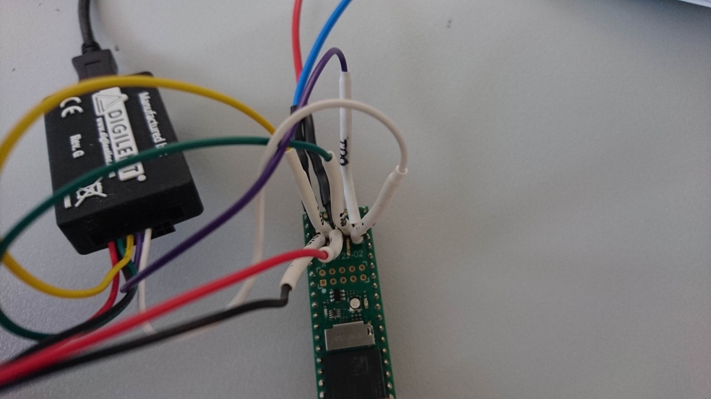
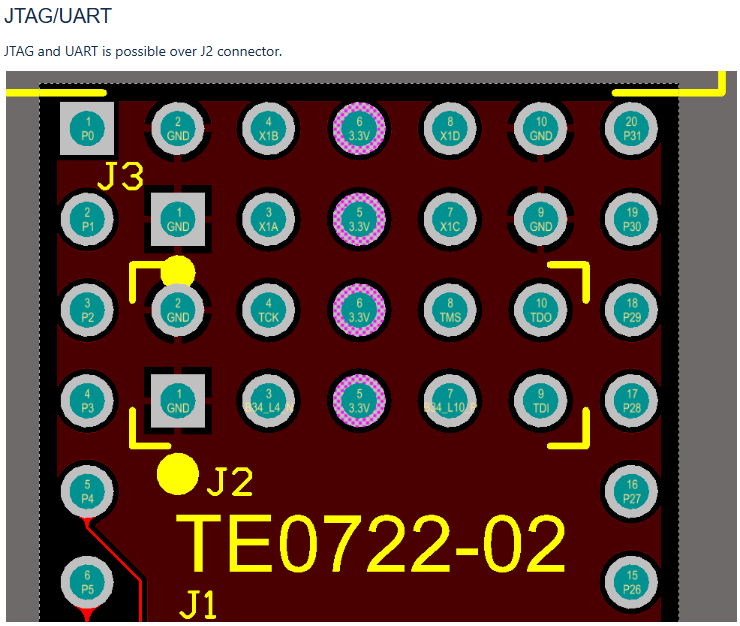

# zynq 7010 na desce trenz electronic DIPFORTy1
### (malá deska)

## Zapojení do JTAG programátoru:

| TE0722-J2 Pin | TE0722-Name | Platform Cable - Name | Platform Cable - Color | external power supply |
|---|---|---|---|---|
| 1 | GND | -- | -- | GND |
| 2 | GND | GND | black | -- |
| 3 | B34_L4_N(def. UART TX) | -- | -- | -- |
| 4 | TCK | TCK | yellow | -- |
| 5 | 3.3V | VREF | red | -- |
| 6 | 3.3V | -- | -- | 3.3V |
| 7 | B34_L10_P(def. UART RX) | -- | -- | -- |
| 8 | TMS | TMS | green | -- |
| 9 | TDI | TDI | white | -- |
| 10 | TDO | TDO | violet | -- |